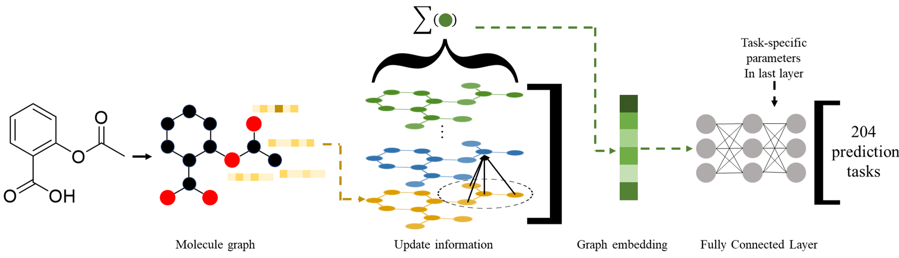
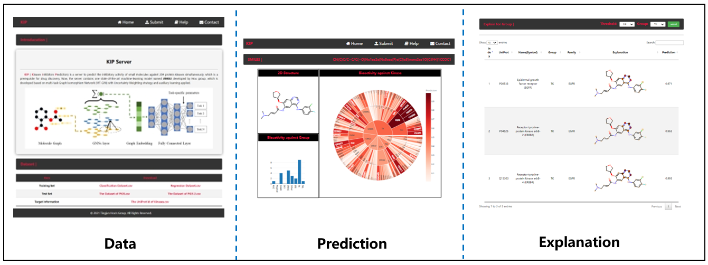

# kip
> Local version for **Kinase Inhibitor Predictor (KIP)**

## 1. introduction
​        **KIP** ( **K**inases **I**nhibitors **P**rediciton) is a server to predict the inhibitory activity of small molecules against 204 protein kinases simultaneously, which is a prerequisite for drug discovery. Now, the server contains one state-of-the-art machine-learning model named AMGU developed by Hou group, which is developed based on multi-task Graph Isomorphism Network (MT-GIN) with Uncertainty Weighting strategy and auxiliary learning applied.



​        This web server can provide service of downloading datasets，prediction the inhibitor activity againset 204 protein kinases(<a href="mysite2/static/file/UniProt.csv"></a>) , explantion.



## 2. Run

```bash
cd mysite2
python manage.py runserver
```

## 3. Citation

**BAO L**, WANG Z, WU Z, et al. Kinome-wide polypharmacology profiling of small molecules by multi-task graph isomorphism network approach [J]. Acta Pharmaceutica Sinica B, 2023, 13(1): 54-67. 

## 4. Contact

​        Please email 3160103569@zju.edu.cn (15857612673@163.com) if any question.
